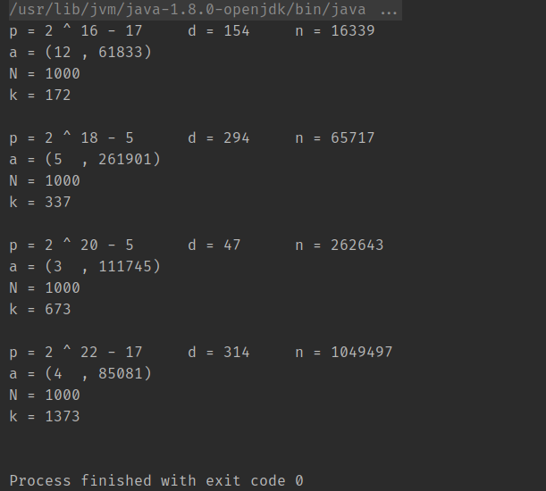

# elliptic-curve

GitHub page: <https://github.com/zhangyuesai/elliptic-curve>

This project implements basic functionality of elliptic curve cryptography, and applies Pollard’s rho algorithm to compute discrete logarithms on small elliptic curves.

This project is an assignment for TCSS 543 Advanced Algorithm Autumn 2019.

## Project structure

- `ECPoint`: a set of operations on points on elliptic curves.
    - `point()`: returns a elliptic curve point.
    - `mul()`: returns the product of two elliptic curve points `a1` and `a2`.
    - `exp()`: returns the exponentiation `a^m` of a elliptic curve point `a`.
    - `rho()`: the discrete logarithm operation, using Pollard's rho algorithm.
    - `check()`: generates a random `m` and calculates `b = a^m`, then calculates `m' = log_a{b}` and check if `m = m'`.
- `SextupleInitializationException`: reports method rho()'s failure for the simple initialization of the sextuple.
- `Driver`: the main program. There are four different parameter sets, on each of which 1000 discrete logarithms are performed and an average number of step `k` is computed.

## Results & analysis

A screenshot of the program running is as follows.

We have already known that Pollard's rho algorithm runs in $O(\sqrt{n})$ time, where $n$ is the order of the elliptic curve. In the program running shown above, each parameter set's `n` is approximately 4 times of that in the previous set, and the number of steps `k` is approximately twice. This confirms that my implementation of Pollard's rho algorithm does run in $O(\sqrt{n})$ time, and is very likely to be correct -- I think it is.

## Reference

1. Professor Paulo Barreto's slides and assignment instructions.
2. Corbellini, A. (2015, May 23). Elliptic Curve Cryptography: finite fields and discrete logarithms. Retrieved from https://andrea.corbellini.name/2015/05/23/elliptic-curve-cryptography-finite-fields-and-discrete-logarithms/
